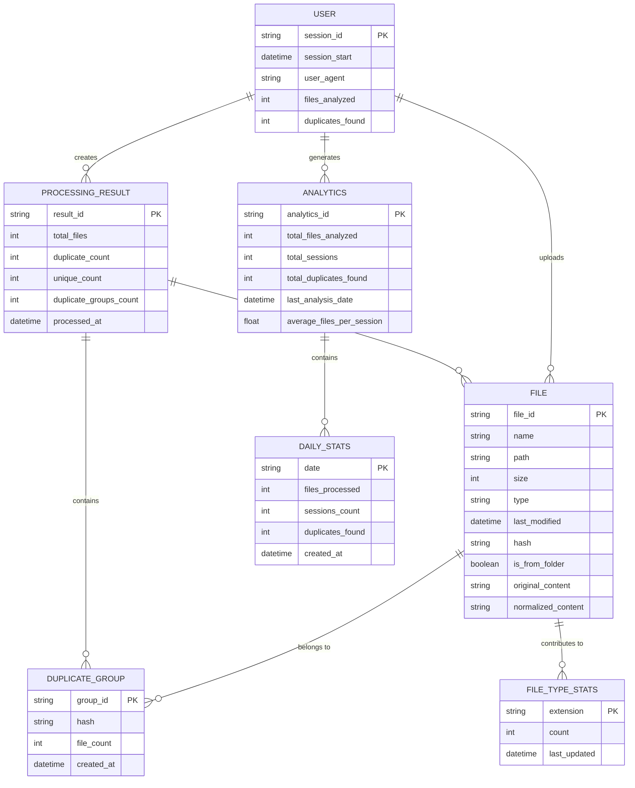
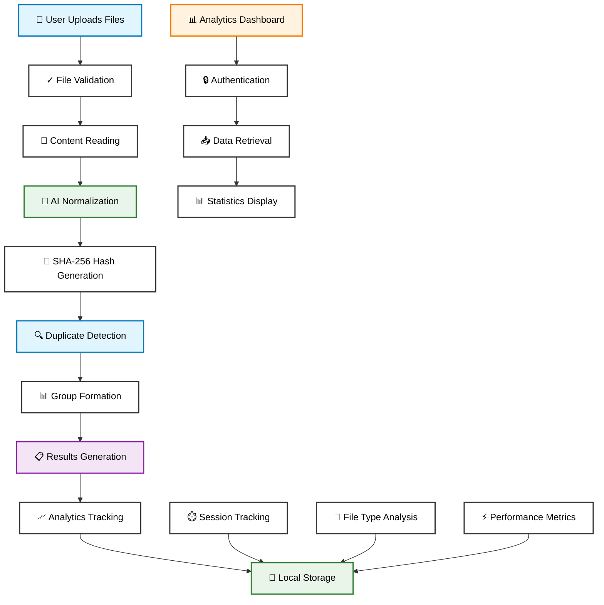
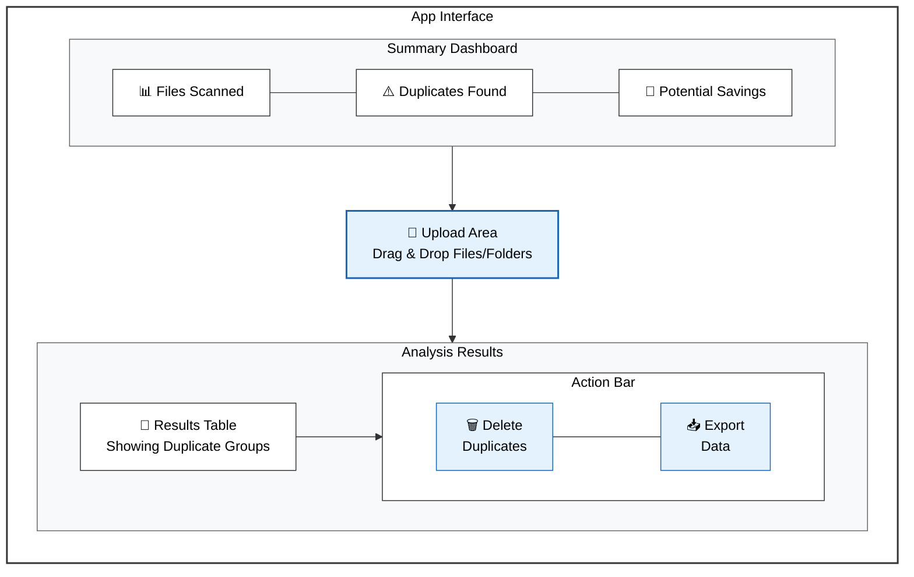
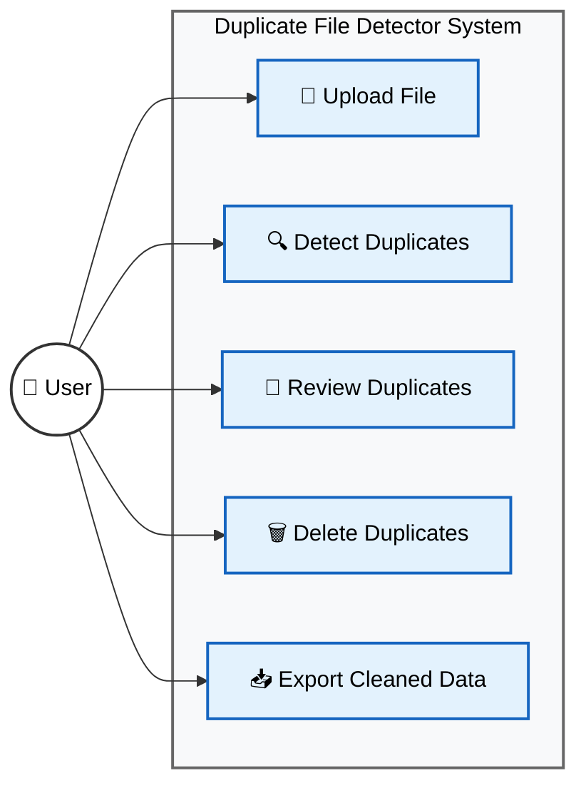
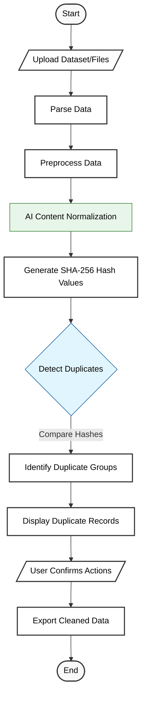

# Duplicate File Detector

An advanced AI-powered duplicate file detection tool built with Next.js, TypeScript, and modern web technologies.

## Features

- 🔍 **Advanced Detection**: AI-powered content normalization for precise duplicate detection
- 📁 **Folder Support**: Upload entire folders and analyze directory structures
- 🚀 **High Performance**: Optimized for analyzing 1000+ files with batch processing
- 🎨 **Modern UI**: Beautiful glassmorphism design with responsive layout
- 📊 **Analytics Dashboard**: Private admin dashboard to track app performance
- 🔐 **Secure**: Password-protected analytics with local data storage
- ⚡ **Fast Processing**: Parallel file processing with progress tracking

## Supported File Types

- **Programming**: .js, .ts, .jsx, .tsx, .py, .java, .cpp, .c, .h, .php, .rb, .go, .rs, .swift, .kt, .scala
- **Web**: .html, .css, .json, .xml, .yml, .yaml
- **Documentation**: .txt, .md, .ini, .cfg, .conf, .toml
- **Scripts**: .sh and more

## How It Works

1. **Upload & Scan**: Drag & drop files or folders for analysis
2. **AI Normalization**: Advanced content normalization removes formatting differences
3. **Cryptographic Hash**: Generates SHA-256 hashes for precise comparison
4. **Smart Analysis**: Groups duplicates with detailed insights and preview capabilities

## Project Structure

```
duplicate-file-detector/
├── app/
│   ├── globals.css                 # Global styles and Tailwind CSS
│   ├── layout.tsx                  # Root layout with metadata
│   ├── loading.tsx                 # Loading component
│   ├── page.tsx                    # Main duplicate detector interface
│   ├── analytics/
│   │   └── page.tsx               # Private analytics dashboard
│   └── api/
│       └── process-files/
│           └── route.ts           # File processing API endpoint
├── components/
│   ├── theme-provider.tsx         # Dark theme provider
│   └── ui/                        # Reusable UI components (Radix UI)
│       ├── button.tsx
│       ├── card.tsx
│       ├── dialog.tsx
│       ├── input.tsx
│       ├── tabs.tsx
│       └── [other UI components]
├── hooks/
│   └── use-toast.ts              # Toast notification hook
├── lib/
│   ├── analytics.ts              # Analytics tracking utilities
│   └── utils.ts                  # Utility functions and helpers
├── public/                       # Static assets
├── styles/
│   └── globals.css              # Additional global styles
├── .env.local                   # Environment variables (git ignored)
├── .gitignore                   # Git ignore rules
├── components.json              # Radix UI configuration
├── next.config.mjs              # Next.js configuration
├── package.json                 # Dependencies and scripts
├── README.md                    # Project documentation
├── tailwind.config.ts           # Tailwind CSS configuration
└── tsconfig.json               # TypeScript configuration
```

## Entity Relationship Diagram



## Data Flow Architecture


### 5. User Interface Design Layout



### 4.1 Use Case Diagram



### 4.3 System Flow Diagram



## Technology Stack

- **Framework**: Next.js 13+ with App Router
- **Language**: TypeScript
- **Styling**: Tailwind CSS with custom animations
- **UI Components**: Radix UI primitives
- **Icons**: Lucide React
- **Processing**: Web APIs (File API, FormData, Crypto)

## Performance

- **Batch Processing**: Handles large file sets efficiently (50 files per batch)
- **Parallel Processing**: Uses Promise.all for concurrent file analysis
- **Memory Optimization**: 5MB file size limit with streaming processing
- **Progress Tracking**: Real-time feedback during analysis

## License

This project is licensed under the MIT License.
